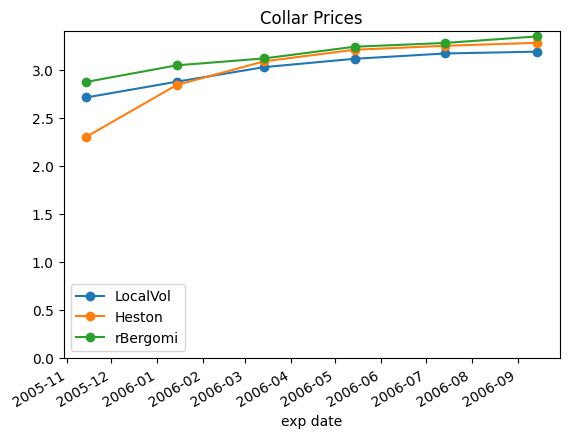

**QATWALK** welcomes all models - the jumps, the roughs, and fat tails...

## Premise
In *“A Perfect Calibration ! Now What ?,”* 2003, Schoutens et al compared 7 volatility models to show that -
though the models were calibrated to the same vanilla prices, they produced different results for exotics such as cliquets, barriers, etc.

Since then, many models have appeared in the landscape, such as the Bergomi, Rough Bergomi and Rough Heston models. There have been studies on the processes, calibration methods, and their implied vol surfaces, but no comprehensive study on their impact on different exotic contracts.

## Proposal
This repositary aims to be an open, collaborative, and growing study. It contains a number of models, with parameters [calibrated to a common volatility surface](01a_VanillaSurface.ipynb)

It contains a series of notebooks, for vanillas, and different exotics such as [cliquets](02_Cliquet.ipynb), barriers, forward options and [forward collars](03b_FwdCollars.ipynb), call-on-calls, and autocallables, to compare prices from each model and gain insights of their specific dynamics.

<table><tr>
<td>  </td>
<td>  </td>
</tr></table>

We will start with a few, and we will let the models, and contracts grow over time with more contributors.

## How to Contribute
You can contribute by

- writing new models (e.g. see [Bergomi](src/model/rbergomi.py))
- writing new contracts, (e.g. see [forward collars](03b_FwdCollars.ipynbipynb))
- calibration methods

Start by looking at the [discussions](https://github.com/qatwalk/eq/discussions) and [issues](https://github.com/qatwalk/eq/issues).